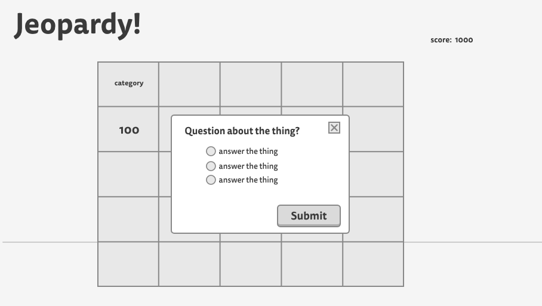

# Jeopardy Game

# [Jeopardy!](http://jeopardygame.bitballoon.com/)

## Project Description

A quiz game where the user chooses a point value from the gameboard. The user then gets a question with multiple answers to choose. User is notified when the chosen answer is right or wrong and the score is updated. When a certain score is reached, the user is notified of winning or losing the game.

The goal of this project is to create a cohesive, interactive application using my knowledge of HTML, CSS, JavaScript and jQuery. 

User stories on [Trello](https://trello.com/b/hD4h43Ae/wdi-project-1)

Full set of [wireframes](http://imgur.com/a/P97nD)

## Built With

* HTML5, CSS, JavaScript, jQuery
* [Materialize](http://materializecss.com/)
* [Google Fonts](https://fonts.google.com/)
* [Font Awesome](http://fontawesome.io/)
* [Transparent Textures](https://www.transparenttextures.com/)
* [Mockingbird](https://gomockingbird.com/)

## Future Development

* multiplayer
* final jeopardy/wager
* better reset button functionality
* responsive CSS
* themes and styling
